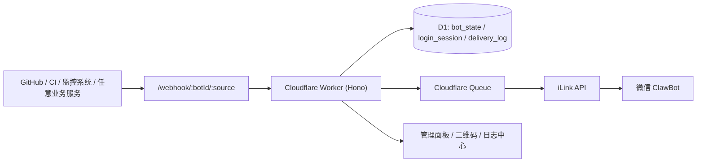

# Cloudflare WeChat Notifier

基于 `Cloudflare Workers + Hono + D1 + Queues` 的 iLink / WeChat ClawBot Webhook 服务。

将外部系统的文本通知桥接到微信 ClawBot，补齐 iLink 协议在云端部署时的关键缺口：扫码登录、`context_token` 激活、多 Bot 管理、投递日志、异步重试、定时保活与补偿，以及可在浏览器中直接操作的轻量管理面板。

[](https://deploy.workers.cloudflare.com/?url=https://github.com/krapnikkk/Cloudflare-WeChat-Notifier)



---

## 目录

- [功能特性](#功能特性)
- [技术栈](#技术栈)
- [适用场景](#适用场景)
- [架构概览](#架构概览)
- [快速开始](#快速开始)
- [配置项说明](#配置项说明)
- [使用流程](#使用流程)
- [管理页面](#管理页面)
- [API 文档](#api-文档)
- [Webhook 调用示例](#webhook-调用示例)
- [投递生命周期](#投递生命周期)
- [项目结构](#项目结构)
- [开发命令](#开发命令)
- [注意事项](#注意事项)
- [许可证](#许可证)

---

## 功能特性

| 能力 | 说明 |
|------|------|
| Webhook 入站 | `POST /webhook/:botId/:source` 接收外部通知，校验后入队，立即返回 `202` |
| iLink 协议封装 | 内置 `getBotQrcode`、`getUpdates`、`sendMessage`、`sendTyping` 等 API |
| 多 Bot 管理 | 支持扫码登录多个 Bot，独立管理、激活、重命名和删除 |
| 扫码登录 | 创建二维码会话 → 自动轮询状态 → 持久化 `bot_token` |
| Bot 激活 | 调用 getUpdates 获取 `context_token` 与 `get_updates_buf` |
| 异步投递 | HTTP 层只写 D1 和入队，Cloudflare Queues 异步消费，立刻响应用户 |
| 敏感信息加密 | `bot_token`、`ilink_user_id`、`context_token` 等入库前 AES-GCM 加密 |
| 投递日志 | 记录每条投递的状态、重试次数、响应码、错误详情，支持按来源/Bot/状态筛选 |
| 幂等去重 | `(botId, source, dedupeKey)` 联合唯一，防止重复投递 |
| 自动重试 | Queue 消费者失败自动重试（最多 3 次，延迟 = attempts × 5s） |
| 定时补偿 | Cron 每 15 分钟扫描卡在 `queued` 超过 10 分钟的投递，重新入队 |
| 保活提醒 | Cron 每 24 小时入队一条交互提醒，帮助维持 `context_token` 有效 |
| 管理面板 | 总览页、二维码页、日志中心 —— 纯 HTML 渲染，打开即用 |

---

## 技术栈

| 模块 | 选型 | 说明 |
|------|------|------|
| 运行时 | Cloudflare Workers | 承载 HTTP 服务和队列消费者 |
| 路由 | Hono | 轻量路由、中间件、错误拦截 |
| 数据库 | Cloudflare D1 | bot 状态、登录会话、投递日志 |
| 队列 | Cloudflare Queues | 入站异步化、失败重试、批量消费 |
| 语言 | TypeScript | 接口契约、依赖注入、类型安全 |
| 测试 | Vitest | 覆盖路由、加密、队列消费和协议 |
| 二维码 | `qrcode` | 服务端渲染 SVG 登录二维码 |

---

## 适用场景

| 场景 | 是否适合 |
|------|---------|
| GitHub Actions / CI 完成推送微信通知 | 适合 |
| Prometheus / Grafana / Sentry 告警推送 | 适合 |
| 监控系统、值班消息、部署回调推送到微信 | 适合 |
| 多个办公系统分别推送到不同微信群 | 适合（多 Bot 模式） |
| Home Assistant 自动化通知（门磁、漏水、安防） | 适合（通过 HA Webhook 桥接） |
| 多租户、复杂权限体系 | 暂不适合 |
| 图片、文件、富媒体消息转发 | 暂不支持 |

---

## 架构概览

```
外部系统 (GitHub / CI / 监控 / HA / ...)
  │
  ├─ POST /webhook/:botId/:source  ← X-Webhook-Token 鉴权
  │   │  validateIncomingMessage()
  │   │  enqueueDelivery(botId, source, { text })
  │   │
  │   ├─ D1 INSERT (status=queued)
  │   └─ Queue.send({ deliveryId })
  │       │                                ┌─── 每 15 分钟 Cron ───┐
  │       ▼                                │    扫描 queued +     │
  │   Queue Consumer 自动触发              │    attempts=0 +      │
  │   handleQueueBatch()                   │    超过 10 分钟       │
  │     processQueuedDelivery()            │    → 重新入队         │
  │       ├─ D1 查 delivery_log           └─────────────────────┘
  │       ├─ Bot 状态检查
  │       ├─ ilinkClient.sendMessage()
  │       ├─ 成功 → D1: delivered, ack
  │       └─ 失败 → D1: retrying/failed, retry/ack
  │
  ▼
 微信 ClawBot 收到消息
```

---

## 快速开始

### 1. 克隆并安装依赖

```bash
git clone <your-repo-url>
cd Cloudflare-WeChat-Notifier
npm install
```

### 2. 创建 Cloudflare 资源

```bash
npx wrangler d1 create ilink-cloudflare
npx wrangler queues create ilink-notification-queue
```

### 3. 配置 `wrangler.jsonc`

```bash
cp wrangler.jsonc.example wrangler.jsonc
```

将上一步输出的 `database_id` 填入 `wrangler.jsonc`，确认队列名一致。

### 4. 配置 Secrets（敏感数据放入 Secret，不要放 vars）

```bash
npx wrangler secret put ADMIN_TOKEN
npx wrangler secret put WEBHOOK_SHARED_TOKEN
npx wrangler secret put BOT_STATE_ENC_KEY
```

`wrangler.jsonc` 中 vars 设置非敏感变量即可：

```jsonc
"vars": {
  "ILINK_BASE_URL": "https://ilinkai.weixin.qq.com",
  "KEEPALIVE_ENABLED": "true",
  "KEEPALIVE_INTERVAL_HOURS": "24",
  "KEEPALIVE_TEXT": "【保活提醒】请和微信 ClawBot 进行一次交互，保持 iLink 上下文可用。"
}
```

### 5. 初始化数据库

```bash
npm run cf:migrate:local
npm run cf:migrate:remote
```

### 6. 部署

```bash
npm run deploy
```

部署成功后，访问 `https://<your-worker>.workers.dev/admin/dashboard?token=<ADMIN_TOKEN>` 进入管理面板。

---

## 配置项说明

### Secrets（通过 `wrangler secret put` 设置）

| 配置项 | 必填 | 用途 |
|--------|------|------|
| `ADMIN_TOKEN` | 是 | 保护 `/admin/*` 和 `/api/*` 接口 |
| `WEBHOOK_SHARED_TOKEN` | 是 | 校验 `/webhook/*` 请求头中的 `X-Webhook-Token` |
| `BOT_STATE_ENC_KEY` | 是 | AES-GCM 加密密钥，保护 D1 中存储的 bot_token 等敏感字段 |

### Variables（在 `wrangler.jsonc` 中设置）

| 配置项 | 默认值 | 用途 |
|--------|--------|------|
| `ILINK_BASE_URL` | `https://ilinkai.weixin.qq.com` | iLink API 地址 |
| `KEEPALIVE_ENABLED` | `true` | 是否启用定时保活提醒 |
| `KEEPALIVE_INTERVAL_HOURS` | `24` | 保活提醒间隔（小时） |
| `KEEPALIVE_TEXT` | `"【保活提醒】..."` | 保活提醒消息文本 |

### Bindings

| Binding | 类型 | 说明 |
|---------|------|------|
| `DB` | D1 | 数据库绑定 |
| `NOTIFICATION_QUEUE` | Queue | 消息投递队列，producer + consumer |

---

## 使用流程

| 步骤 | 操作 |
|------|------|
| 1 | 打开 `/admin/dashboard?token=<ADMIN_TOKEN>` 进入总览页 |
| 2 | 点击 **「添加 Bot」**，打开二维码登录页 |
| 3 | 使用微信扫码，等待状态变为 `confirmed` |
| 4 | 在微信 ClawBot 对话框中主动发一条消息（建立会话上下文） |
| 5 | 回到总览页，点击该 Bot 的 **「激活」** 按钮 |
| 6 | Bot 状态变为 `ready` 后，在面板中发送测试消息验证 |
| 7 | 将外部系统的 Webhook 指向 `POST /webhook/:botId/:source` |

---

## 管理页面

### 总览页

```
/admin/dashboard?token=ADMIN_TOKEN&refresh=10&logsLimit=12
```

- 所有 Bot 状态卡片（含状态指示灯）
- 在线编辑 Bot 标签名称
- 逐 Bot 激活 / 测试发送
- 最近投递日志实时预览
- 自动刷新（默认 5 秒，可通过 `?refresh=N` 调整，设为 0 关闭）

### 二维码登录页

```
/admin/bot/login/qrcode/page?token=ADMIN_TOKEN
```

- 服务端渲染 SVG 二维码
- 前端自动轮询扫码状态（`wait → scanned → confirmed`）
- 确认后自动保存 bot_token

### 日志中心

```
/admin/deliveries/page?token=ADMIN_TOKEN&status=failed&source=github&botId=xxx&limit=50
```

- 按状态 (`queued` / `retrying` / `delivered` / `failed`) 筛选
- 按来源 (`source`) 和 Bot 筛选
- 分页浏览 + 自动刷新（可选 关闭 / 3s / 5s / 10s / 30s）
- 批量重放 / 批量删除
- 查看单条投递详情

---

## API 文档

### 健康检查

| 方法 | 路径 | 鉴权 |
|------|------|------|
| `GET` | `/healthz` | 无 |

### Bot 管理

| 方法 | 路径 | 鉴权 | 说明 |
|------|------|------|------|
| `GET` | `/admin/bots` | Bearer / `?token=` | 列出所有 Bot（脱敏） |
| `POST` | `/admin/bot/login/qrcode` | Bearer | 创建登录二维码会话 |
| `GET` | `/admin/bot/login/status/:sessionId` | Bearer / `?token=` | 查询扫码状态 |
| `GET` | `/admin/bot/:botId/status` | Bearer / `?token=` | 查询指定 Bot 状态 |
| `POST` | `/admin/bot/:botId/activate` | Bearer / `?token=` | 激活指定 Bot |
| `PATCH` | `/admin/bot/:botId` | Bearer / `?token=` | 更新 Bot label |
| `DELETE` | `/admin/bot/:botId` | Bearer / `?token=` | 删除指定 Bot |

### 投递日志

| 方法 | 路径 | 鉴权 | 说明 |
|------|------|------|------|
| `GET` | `/admin/deliveries` | Bearer / `?token=` | 分页查询，支持 `?status=&source=&botId=&limit=&page=` |
| `GET` | `/admin/deliveries/:deliveryId` | Bearer / `?token=` | 查询单条投递详情 |
| `POST` | `/admin/deliveries/:deliveryId/replay` | Bearer / `?token=` | 重放单条失败投递 |
| `POST` | `/admin/deliveries/batch/replay` | Bearer / `?token=` | 批量重放（`{ "deliveryIds": [...] }`，最多 100 条） |
| `POST` | `/admin/deliveries/batch/delete` | Bearer / `?token=` | 批量删除已完成投递（`{ "deliveryIds": [...] }`，最多 100 条） |
| `POST` | `/admin/deliveries/replay-ret2` | Bearer / `?token=` | 重放所有 `ret=-2` 的失败投递 |
| `POST` | `/admin/deliveries/compensate-queued` | Bearer / `?token=` | 手动补偿卡住超过 10 分钟的 `queued` 投递 |

### 消息入站

| 方法 | 路径 | 鉴权 | 说明 |
|------|------|------|------|
| `POST` | `/api/send` | Bearer | 管理员手动发送，需指定 `botId` |
| `POST` | `/webhook/:botId/:source` | `X-Webhook-Token` | 外部 Webhook 入口（推荐） |

---

## Webhook 调用示例

### 标准消息体

```json
{
  "text": "生产环境部署成功",
  "traceId": "deploy-20260730-001",
  "dedupeKey": "deploy-20260730-prod",
  "meta": {
    "env": "prod",
    "branch": "main"
  }
}
```

### GitHub Actions

```bash
curl -X POST "https://your-worker.workers.dev/webhook/bot-xxx/github" \
  -H "Content-Type: application/json" \
  -H "X-Webhook-Token: $WEBHOOK_SHARED_TOKEN" \
  -d '{"text":"CI passed on main","traceId":"run-123","meta":{"repo":"demo/app"}}'
```

### Prometheus Alertmanager

```yaml
receivers:
  - name: wechat
    webhook_configs:
      - url: "https://your-worker.workers.dev/webhook/bot-xxx/monitoring"
        http_config:
          headers:
            X-Webhook-Token: "<WEBHOOK_SHARED_TOKEN>"
        send_resolved: true
```

### Home Assistant (通过 REST Command)

```yaml
rest_command:
  wechat_notify:
    url: "https://your-worker.workers.dev/webhook/bot-xxx/mijia"
    method: POST
    headers:
      content-type: "application/json"
      x-webhook-token: "<WEBHOOK_SHARED_TOKEN>"
    payload: '{"text": "{{ message }}"}'
```

### 命名规范建议

- `source` 建议用有意义的标识：`github` / `monitoring` / `mijia` / `sentry` / `jira`
- 日志中心可按 source 筛选，方便回溯
- `dedupeKey` 可选，同一 `(botId, source, dedupeKey)` 组合只投递一次

---

## 投递生命周期

每一条入站消息在系统中的状态流转：

```
HTTP 请求
  │
  ├─ 1. D1 INSERT delivery_log  status=queued
  ├─ 2. Queue.send({ deliveryId })
  │
  ▼
Queue Consumer 自动消费
  │
  ├─ 查 D1 → Bot 已删除 / 未激活？
  │    └─ 是 → status=failed, ack（丢弃消息）
  │
  ├─ ilinkClient.sendMessage()
  │    ├─ 成功       → status=delivered, ack
  │    │
  │    ├─ 可重试异常 (5xx / 超时) & attempts ≤ 3
  │    │    └─ status=retrying, retry（延迟 = attempts × 5s）
  │    │
  │    ├─ unauthorized → Bot → needs_login, status=failed, ack
  │    ├─ context 失效 → Bot → needs_activation, status=failed, ack
  │    │
  │    └─ 超过 3 次  → status=failed, ack（彻底放弃）
  │
  ▼
Cron 兜底（每 15 分钟）
  │
  └─ 扫描 queued + attempts=0 + 超过 10 分钟
       └─ 重新入队
```

---

## 项目结构

```
src/
├── index.ts                  # Worker 入口（fetch / queue / scheduled 三个 handler）
├── app.ts                    # Hono 路由定义、中间件、鉴权
├── container.ts              # 依赖注入容器（创建 AppContext）
├── contracts.ts              # 接口契约（类型、接口定义）
├── ilink/
│   └── client.ts             # iLink 协议客户端（登录、收发消息）
├── services/
│   ├── admin-service.ts      # Bot 管理服务
│   ├── delivery-service.ts   # 投递核心服务（入队、消费、补偿、保活）
│   └── health-service.ts     # 健康检查服务
├── storage/
│   ├── bot-state-repository.ts       # Bot 状态 D1 仓储
│   ├── login-session-repository.ts   # 登录会话 D1 仓储
│   └── delivery-log-repository.ts    # 投递日志 D1 仓储
├── queue/
│   └── consumer.ts           # Queue 消费调度（逐条消费 + ack/retry 决策）
├── lib/
│   ├── dashboard-page.ts     # 总览页 HTML 模板
│   ├── delivery-log-page.ts  # 日志中心 HTML 模板
│   ├── encryption.ts         # AES-GCM 加密工具
│   ├── errors.ts             # AppError / IlinkApiError 错误类
│   ├── id.ts                 # client_id / wechat_uin 生成
│   └── validation.ts         # 请求体校验
migrations/
├── 0001_init.sql             # 初始表结构
└── 0002_multi_bot.sql        # 多 Bot 迁移（重构 bot_state + delivery_log）
test/                         # Vitest 测试用例
```

---

## 开发命令

| 命令 | 说明 |
|------|------|
| `npm run dev` | 本地启动 Worker (`wrangler dev`) |
| `npm run deploy` | 部署到 Cloudflare Workers |
| `npm run typecheck` | TypeScript 类型检查 |
| `npm test` | 运行所有测试 |
| `npm run test:watch` | 监听模式运行测试 |
| `npm run cf:migrate:local` | 对本地 D1 应用迁移 |
| `npm run cf:migrate:remote` | 对远程 D1 应用迁移 |

---

## 注意事项

### ClawBot 消息限制

- 单条文本长度：微信约 2048 字符上限，超长内容 iLink 会拒绝
- `context_token` 有效期：约 24 小时无交互后过期，Bot 会被自动标为 `needs_activation`
- 高频推送风险：持续大量发消息可能触发微信风控 —— 严重时可导致 Bot token 失效甚至关联微信号受限

### 使用建议

- 对接监控告警时，建议在调用侧加一层 debounce（同一告警短时间内不重复推送）
- 利用 `dedupeKey` 做到应用层幂等去重
- 避免将高频心跳类消息（如每 5 秒一次）直接推送到微信
- 敏感凭证（`ADMIN_TOKEN`、`WEBHOOK_SHARED_TOKEN`、`BOT_STATE_ENC_KEY`）务必通过 `wrangler secret put` 设置
- 保活提醒只对 `ready` 状态的 Bot 生效，Bot 未激活或需要重新登录时保活不会执行

### 已知限制

- 仅文本消息，暂不支持图片、文件、卡片等类型
- 无多租户和用户权限体系
- 管理面板为轻量 HTML 页面，非 SPA

---

## 协议参考

- iLink / WeClawBot-API: [https://github.com/Cp0204/WeClawBot-API](https://github.com/Cp0204/WeClawBot-API)

---

## 许可证

[MIT](LICENSE)
